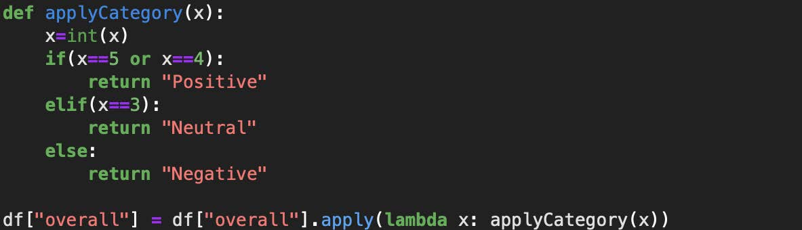

# Project Report - Sentiment Analysis using CountVectorizer LR and TF-IDF

## Introduction

We have a dataset of text data,with around more than 350,000 reviews from different customers giving their own ratings and reviews towards their own product(s) they have bought. We also do have the meta data of several such products, starting by the name of the product to its description.

We use this text-dataset to make Sentiment Analysis by using Classification Algorithms like Logistic Regression and TF-IDF.

## Methods

We are going to work on this dataset using the Logistic Regression and TF-IDF Technique along with the Logistic Regression for its fit.

First of all, we begin with the required imports for analysis. Then convert our data from the dataset to a pandas data frame.

Next, we start to understand what is required from our data, and manipulate or remove values which are not useful to our goal of analysis.

Next for our general logistic regression analysis, we begin by lowercasing our ‘reviewText’

Then we also remove any newline strings, which are not useful in our text.

Next, we remove the punctuations,

And then we do the stopword removal from the NLTK library.

We can then either go with stemming or lemmatization. I went with stemming  the text corpus.

Then I made the classification of the response variable using a custom method.

### Logistic Regression

For implementation, I made the train-test split of the dataset using scikit-learn. (66-33 = Train-test-split)

I utilized the count vectorizer from the same library, to make the fit.

### TF-IDF

After making the split (which was done before), I have used the TfIdfVectorizer from Scikit-learn to produce my fit.

## Results

### Logistic Regression

Accuracy using logistic regression has turned out be 0.84.

### TF-IDF

Accuracy using TF-IDF has turned out to be 0.76.

## Conclusion

In logistic regression, the accuracy is high enough on the overall dataset, but the precision (especially for the neutral category) can be improved by balancing on the data size by categories (Negative, Positive and Neutral) 

The TF-IDF Scores are improper due to the length of the data we have analyzed. The best way to counter something like that is to smoothen the fit by preventing ‘zero-division’. We have observed that simple logistic regression using count vectorizer can work enough over TF-IDF for our dataset.

## References (cite all the sources)

https://scikit-learn.org/stable/modules/generated/sklearn.feature_extraction.text.CountVectorizer.html
https://nijianmo.github.io/amazon/index.html

Justifying recommendations using distantly-labeled reviews and fined-grained aspects

Jianmo Ni, Jiacheng Li, Julian McAuley
Empirical Methods in Natural Language Processing (EMNLP), 2019

